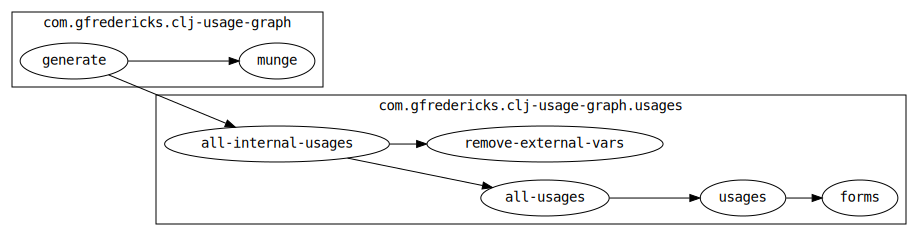

# clj-usage-graph

A Clojure library that emits usage diagrams for your project.



## Caveats

1. For some graph types it will load all the source files you give it,
   so beware of any top-level side-effects.
2. It doesn't reflect macro usage at all. Any macros in your project
   will appear unused, as only the expanded code is analyzed.
3. Needs better support for top level effects, protocols, and records.

## Obtention

Leiningen coordinates:

``` clojure
[com.gfredericks/clj-usage-graph "0.2.1"]
```

## User Profile Setup

You can use `clj-usage-graph` simply by adding it as a dependency
and calling the appropriate functions, but I like this setup in my
`~/.lein/profiles.clj`:

``` clojure
{:user
 {...
  :aliases {"var-graph"
            ["with-profile" "+clj-usage-graph" "lein" "run"
             "-m" "com.gfredericks.clj-usage-graph/var-graph"]
            "namespace-graph"
            ["with-profile" "+clj-usage-graph" "lein" "run"
             "-m" "com.gfredericks.clj-usage-graph/namespace-graph"]}}

 ;; separate profile so that we only have these deps when we're
 ;; actually using clj-usage-graph
 :clj-usage-graph
 {... :dependencies [...
                     [com.gfredericks/clj-usage-graph "0.2.1"]]}
```

## Usage

Make sure you have graphviz installed and thus the `dot` command
available.

### Var Usage Graphs

```
find src -type f | \
xargs lein run -m com.gfredericks.clj-usage-graph/generate | \
dot -Tsvg -o g.svg
```

###

## License

Copyright © 2013 Gary Fredericks

Distributed under the Eclipse Public License, the same as Clojure.
